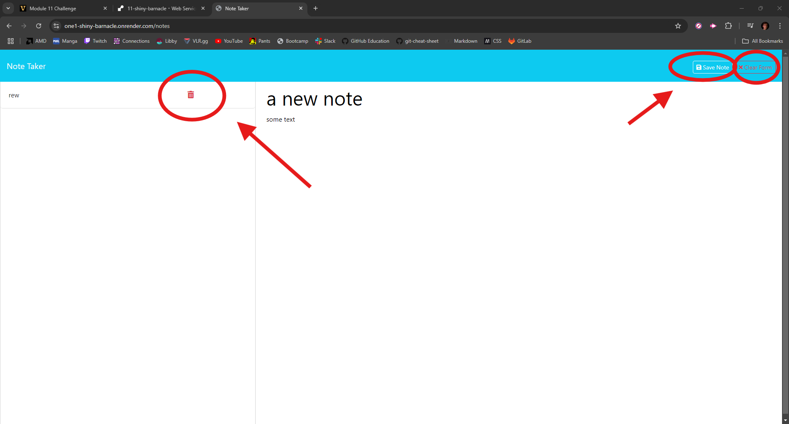

# Note Taking App

  
## Description

As an organized student, I want a note taking app, so that I can keep all of my projects in one place

## Contents

- [Installation](#installation)
- [Usage](#usage)
- [Credits](#contributing)
- [License](#license)

## Installation

To experience the deployed application on render, navigate to the following url: https://one1-shiny-barnacle.onrender.com

## Usage

To start, click the "Get Started" button.

You will then be redirected to a page with notes pulled from an api database.

You can create a new note, by writing in the title and text field and clicking the "Save Note" button.

You can clear your current text entry by clicking the "Clear Form" button.

## Contributing

This code was programmed using started code from the github repository miniature-eureka from user Xandromus: https://github.com/coding-boot-camp/miniature-eureka

## License

MIT License Copyright (c) <year> <author>

Permission is hereby granted, free of charge, to any person obtaining a copy of this software and associated documentation files (the "Software"), to deal in the Software without restriction, including without limitation the rights to use, copy, modify, merge, publish, distribute, sublicense, and/or sell copies of the Software, and to permit persons to whom the Software is furnished to do so, subject to the following conditions:

The above copyright notice and this permission notice (including the next paragraph) shall be included in all copies or substantial portions of the Software.

THE SOFTWARE IS PROVIDED "AS IS", WITHOUT WARRANTY OF ANY KIND, EXPRESS OR IMPLIED, INCLUDING BUT NOT LIMITED TO THE WARRANTIES OF MERCHANTABILITY, FITNESS FOR A PARTICULAR PURPOSE AND NONINFRINGEMENT. IN NO EVENT SHALL THE AUTHORS OR COPYRIGHT HOLDERS BE LIABLE FOR ANY CLAIM, DAMAGES OR OTHER LIABILITY, WHETHER IN AN ACTION OF CONTRACT, TORT OR OTHERWISE, ARISING FROM, OUT OF OR IN CONNECTION WITH THE SOFTWARE OR THE USE OR OTHER DEALINGS IN THE SOFTWARE.

## Questions

Questions about the prooject should be directed through the following contacts below.
Link to github profile: [mcellis1](https://github.com/mcellis1)
Email: [matthewcellis98@gmail.com](mailto:matthewcellis98@gmail.com)
